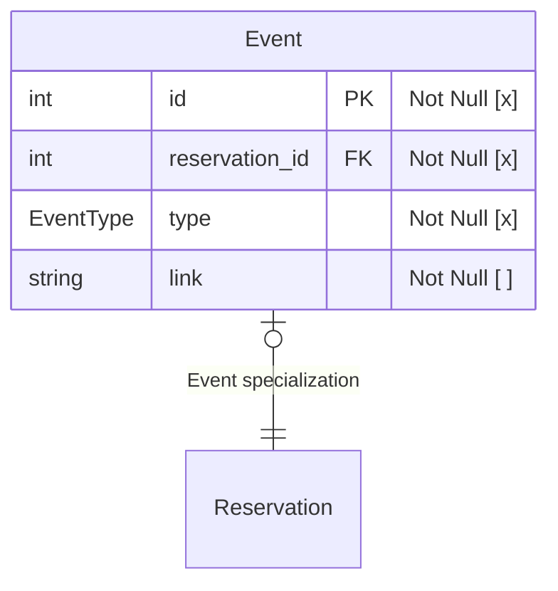

# Tabelas, Modelos e Relacionamentos

```mermaid
erDiagram
    Event {
        int id PK "Not Null [x]"
        int reservation_id FK "Not Null [x]"
        EventType type "Not Null [x]"
        string link "Not Null [ ]"
    }
    Event |o--|| Reservation : "Event specialization"
```
